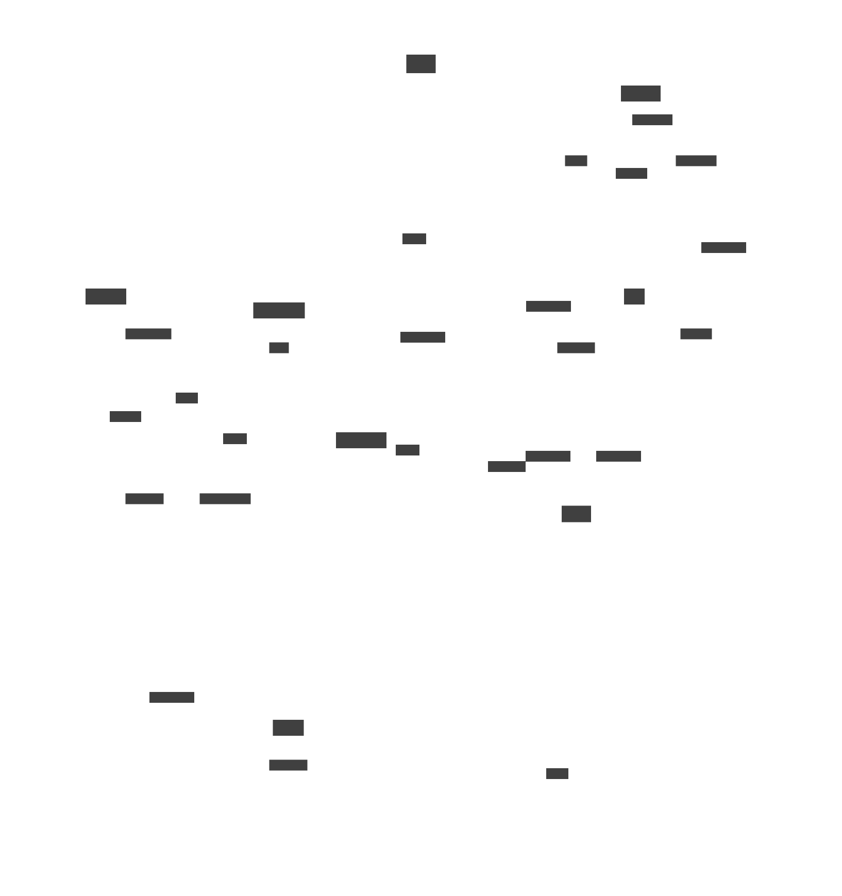
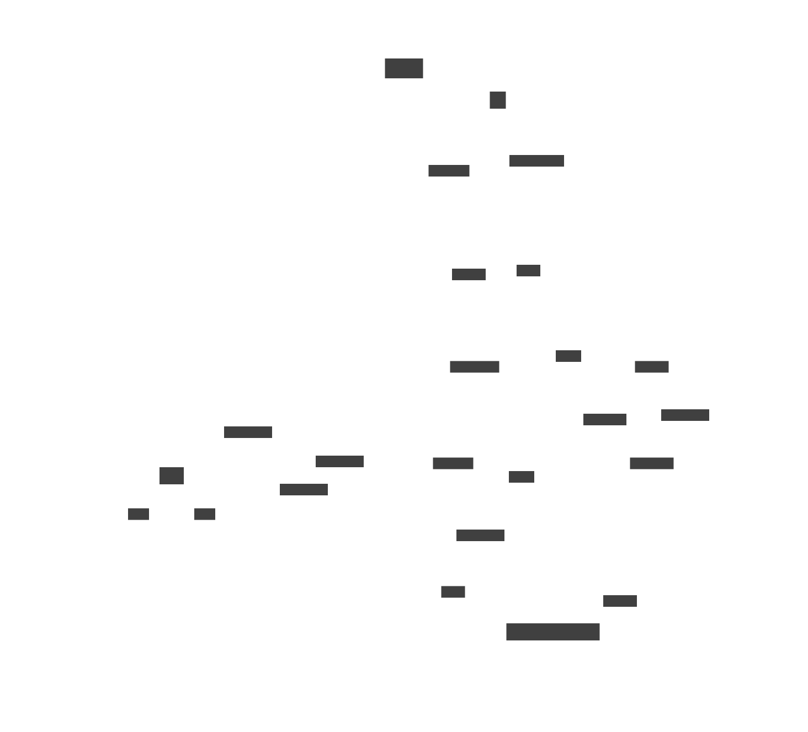
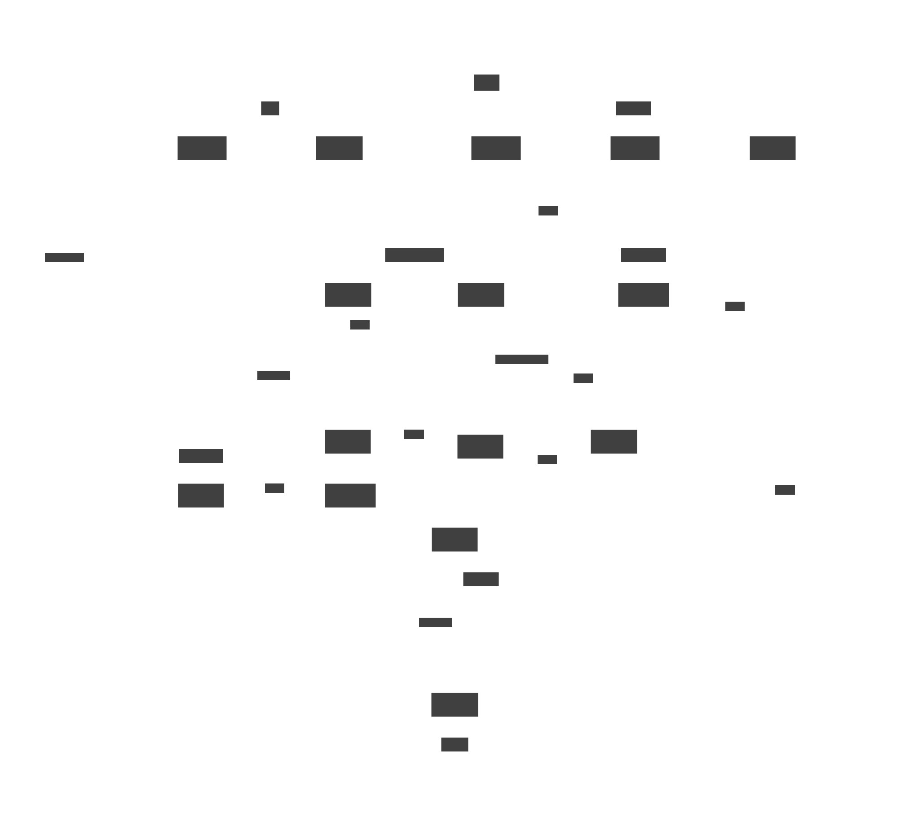
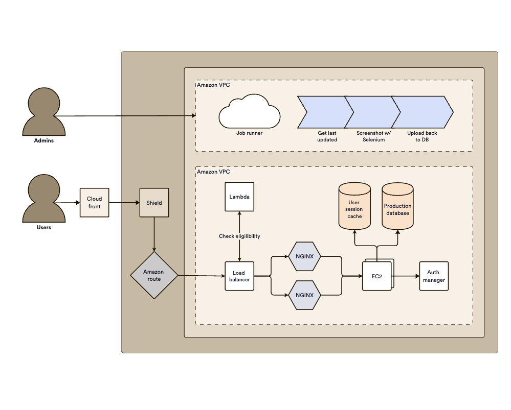

# dictim.server
Diagrams as code.

## What is it?

[d2](https://github.com/terrastruct/d2) by Terrastruct is a text domain specific language for expressing a diagram. It is also a Go executable which converts the d2 text into a diagram itself e.g. svg, png etc.

[dictim](https://github.com/judepayne/dictim) is a data-ized version of d2, for when you want to describe your diagram as data rather than text. If you already have the data that describes a diagram in a database or source control. Like d2, dictim is also a compiler which converts the dictim format into d2.

**dictim server** is a handy deployable webserver which offers a REST api to convert dictim in json form into diagrams.

A one stop shop for:    dictim -> d2 -> diagram


## Why

Diagrams as code.

Producing diagrams dynamically from data is a powerful way to understand a complex system. Not only does it automate away a lot of work, but being dynamic opens up new possibilities. Imagine being able to highlight certain aspects of your diagram during a presentation, change the scope of the data shown in response to a question or group/ slice the data in a different way as the thought occurs.

Ordinary diagrams go stale over time, but data driven diagrams are generated at the point that you need them from the most up to date data.


## Gallery

<table style="float:middle">
  <tr>
    <td></td>
    <td></td>
    <td></td>
  </tr>
  <tr>
    <td></td>
    <td></td>
    <td></td>
  </tr>
</table>


## API

Currently there are two functions.
- The high-level graph api on the `/graph` route for boxes and arrows diagrams. (Technically called network diagrams) [Tutorial and Reference](graph_ref.md)
- The low-level dictim api on the `/dictim` route which can be used to create all of the diagram styles that d2 provides (including sequence diagrams). [Tutorial and Reference](dictim_ref.md)


**TODO** A todo is to build a second high-level api dedicated to sequence diagrams.


## Deploy

There are two options for deploying dictim server: as a standalone microservice jar or as a container that runs the microservice.

### Configure

Before building one of these options, you might wish to configure the build..

In the `resources` directory are a couple of files that you might wish to change.

- PORT contains the port that the microservice runs on.

- THEME the color scheme of the diagram. See the [options](https://d2lang.com/tour/themes/).

- LAYOUT_ENGINE this is the layout engine used by d2. This is defaulted to `dagre`. `elk` is another free option, but for most use cases I find that Terrastruct's proprietary `tala` engine works best. The set up of tala is slightly more involved since in order to produce diagrams without a watermark, tala requires a licensed api token that you can obtain from Terrastruct.

In the container based build option, tala is installed into the container by default. For a serious container based production setup, we would recommend using Docker secrets or similar to mange the tala api token.

For a quick and very insecure solution (e.g. for testing), put your tala api token into the docker/tala.env file before building the container.

Currently, the theme and layout engine are configure per instance of the dictim.server microservice rather than per call to the microservice. This is a choice to help foster a standardized look and feel across a team. If you wish to use more than layout, or theme, build multiple instances of the microservice.

### Standalone webserver jar

  > You'll need Clojure installed for this option to build the jar.

  > This option requires you to have d2 installed locally, and the d2 layout engine 'tala' if you choose to use it.

First let's clone the ditectory and cd into it:

```bash
git clone https://github.com/judepayne/dictim.server.git && cd dictim.server
```

By default, the webserver that you're about to build runs on port 5001. If you wish the change that, edit the entry in src/app/core.clj.

then, build the standalone jar file:

```bash
clj -T:build uber
```

This will produce a `target/` folder in the dictim.server directory. Within that you'll find a jar called named `dictimserver-standalone.jar`.

You can run this from where it is, or move it to somewhere else, e.g. a different machine.

Then run it with:

```bash
java -jar /<path>/<to>/dictimserver-standalone.jar
```

From another terminal you can use curl to post the example command above to the /graph api.


### As a container

First let's clone the ditectory and cd into it:

```bash
git clone https://github.com/judepayne/dictim.server.git && cd dictim.server
```

In the dictim.server folder there is a `Dockerfile` that can be used to build a container than builds the standalone webserver and downloads and installs d2 so it's a complete solution for hosting dictim.server.

Let's build the container image. You should have Docker or Podman or another container management solution installed that is api compatible with Docker.

```bash
./build.sh
```

This script accept the container management program as an argument, defaults to 'docker', but if you you another container manager, e.g. podman, you can pass that as an argument to the script e.g.

```bash
./build.sh podman
```


Let's start the new container

```bash
./run.sh
```

You can pass in the name of an alternative container management program to the script as before.

That will start the container and the webserver within it listening on port 5001 (or the port you've set in the configure step) exposed through to your local machine.

Try posting to the webserver using any of the sample `curl` commands in src/app/sample.txt


**TODO**
- Switch from using http to https
- Consider building a high level api for sequence diagrams as `/graph` is for network diagrams.
- Arbitrary nesting of conditions
- more tests


## License

Copyright © 2024 Jude Payne

Distributed under the [MIT License](http://opensource.org/licenses/MIT)