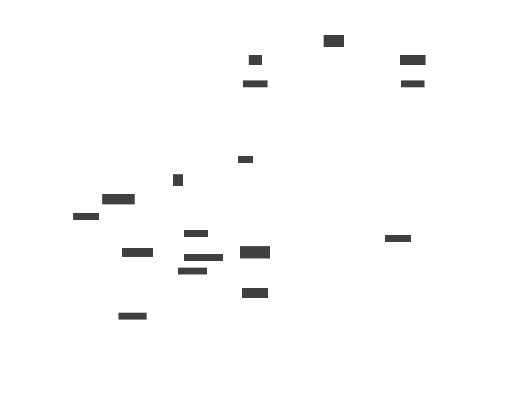

# dictim.server
Dictim dockerized. Call a web server to convert dictim into svg!

## What is it?

[d2](https://github.com/terrastruct/d2) by Terrastruct is a text domain specific language for expressing a diagram. It is also a Go executable which converts the d2 text into a diagram itself e.g. svg, png etc.

[dictim](https://github.com/judepayne/dictim) is a data-ized version of d2, for when you want to describe your diagram with data rather than text e.g. if you already have it sitting in a database. It will compile data in dictim format into d2 (and back again).

**dictim server** is a handy deployable webserver which offers a REST api to convert dictim into diagrams.


## Why

Being able to produce diagrams dynamically from data is a powerful way to understand a complex system. Not only does it automate away a lot of work, but being dynamic opens up new possibilities; imagine being able to highlight certain aspects of your diagram during a presentation, change the scope of the data shown in response to a question or group/ slice the data in a different way.


## Show me an example

dictim server has two api's. A high level api for boxes and arrows diagrams (i.e. Architecture diagrams) and a lower level api where you pass in dictim in json form. This can be useful for other types of diagrams like sequence diagrams.

Here's an example of the high level api '/graph' generating an architectural diagram.



was generated by POSTing this json to a running instance of dictim.server..

<details>

<summary> The POST request ... </summary>

```bash
curl --header "Content-Type: application/json" \
  --request POST \
  --data '{
  "nodes": [
    {
      "id": "app12872",
      "name": "Trade pad",
      "owner": "Lakshmi",
      "dept": "Finance",
      "functions": [
        "Position Keeping",
        "Quoting"
      ],
      "tco": 1200000,
      "process": "p.112"
    },
    {
      "id": "app12873",
      "name": "Data Source",
      "owner": "India",
      "dept": "Securities",
      "functions": [
        "Booking",
        "Order Mgt"
      ],
      "tco": 1100000,
      "process": "p.114"
    },
    {
      "id": "app12874",
      "name": "Crypto Bot",
      "owner": "Joesph",
      "dept": "Equities",
      "functions": [
        "Accounting",
        "Booking"
      ],
      "tco": 500000,
      "process": "p.112"
    },
    {
      "id": "app12875",
      "name": "Data Solar",
      "owner": "Deepak",
      "dept": "Securities",
      "functions": [
        "Position Keeping",
        "Data Master"
      ],
      "tco": 1000000,
      "process": "p.114"
    },
    {
      "id": "app12876",
      "name": "Data Solar",
      "owner": "Lakshmi",
      "dept": "Risk",
      "functions": [
        "Accounting",
        "Data Master"
      ],
      "tco": 1700000,
      "process": "p.114"
    }
  ],
  "edges": [
    {
      "src": "app12874",
      "dest": "app12875",
      "data-type": "security reference"
    },
    {
      "src": "app12874",
      "dest": "app12876",
      "data-type": "quotes"
    },
    {
      "src": "app12875",
      "dest": "app12875",
      "data-type": "instructions"
    },
    {
      "src": "app12874",
      "dest": "app12872",
      "data-type": "instructions"
    },
    {
      "src": "app12875",
      "dest": "app12874",
      "data-type": "client master"
    },
    {
      "src": "app12875",
      "dest": "app12874",
      "data-type": "allocations"
    }
  ],
  "node->key": "id",
  "node->container": "dept",
  "container->parent": {
    "Finance": "2LOD",
    "Risk": "2LOD",
    "Securities": "FO",
    "Equities": "FO"
  },
  "node-specs": {
    "labels": [
      [
        {
          "key": "owner"
        },
        [
          "equals",
          "dept",
          "Equities"
        ]
      ],
      [
        {
          "key": "name"
        }
      ]
    ]
  },
  "edge-specs": {
    "labels": [
      [
        {
          "key": "data-type"
        }
      ]
    ]
  },
  "container->attrs": {
    "Securities": {
      "style.fill": "green"
    }
  }
}'
  http://localhost:5001/graph
```

</details>

The inputs of the '/graph' api are discussed below.


## Building

There are two options for deploying dictim server; as a standalone microservice jar or as a container (that has the microservice running within it).

### Configuration before building

Before building one of these options, you might wish to configure the build..

In the `resources` directory are a couple of files that you might wish to change.

- PORT contains the port that the microservice runs on.

- LAYOUT_ENGINE this is the layout engine used by d2. This is defaulted to `dagre`. `elk` is another free option, but for most use cases I find that Terrastruct's proprietary `tala` engine works best. The set up of tala is slightly more involved since in order to produce diagrams without a watermark, tala requires a licensed api token that you can obtain from Terrastruct.

In the container based build option, tala is installed into the container by default. For a serious container based production setup, we would recommend using Docker secrets or similar to mange the tala api token.

For a quick and very insecure solution (e.g. for testing), put your tala api token into the docker/tala.env file before building the container.


### Standalone webserver jar

  > You'll need Clojure installed for this option to build the jar.

  > This option requires you to have d2 installed locally, and the d2 layout engine 'tala' if you choose to use it.

First let's clone the ditectory and cd into it:

```bash
git clone https://github.com/judepayne/dictim.server.git && cd dictim.server
```

By default, the webserver that you're about to build runs on port 5001. If you wish the change that, edit the entry in src/app/core.clj.

then, build the standalone jar file:

```bash
clj -T:build uber
```

This will produce a `target/' folder in the dictim.server directory. Within that you'll find a jar called named `dictimserver-standalone.jar`.

You can run this from where it is, or move it to somewhere else, e.g. a different machine.

Then run it with:

```bash
java -jar /<path>/<to>/dictimserver-standalone.jar
```

From another terminal you can use curl to post the example command above to the /graph api.


### As a container

In the dictim.server folder there is a `Dockerfile` that can be used to build a container than builds the standalone webserver and downloads and installs d2 so it's a complete solution for hosting dictim.server.

From the dictim.server directory that you cloned locally, first let's build the container image. (Of course, you should have Docker or Podman or another container management solution installed)

```bash
./build.sh
```

This script accept the container management program as an argument, defaults to 'docker', but if you you another container manager, e.g. podman, you can pass that as an argument to the script e.g.

```bash
./build.sh podman
```


Let's start the new container

```bash
./run.sh
```

(You can pass in the name of an alternative container management program to the script as before.)

That will start the container and the webserver within it listening on port 5001 (or the port you've set) exposed through to your local machine.

Try posting to the webserver using the example `curl` command at the top of this Readme.


## Apis

As mentioned, the standalone webserver has two apis, the high level graph api on the `/graph` route that useful for boxes and arrows type diagrams and the lower level dictim api available on the `/dictim' route.

Let's explore each in a little more detail.

### graph api

As the name suggests this api for architecture diagrams, models the boxes and arrows as a graph, where the boxes are nodes and the arrows edges.

You should send a POST request to the `/graph` route with a json map with the following keys.

*Manatory keys:*

| key | expanation |
| `"nodes"` | a vector of maps, each map being a representation of one node. The maps don't have to be homogenous (i.e. have the same keys) but often are if you representing multiple instances of the same type of thing. |
| `"edges"` | a vector of maps, each map being a representation of one edge. Each edge must have `"src"` and `"dest"` keys and any other keys you need to model the edge. Again, they don't need to be homogenous but often are. the `"src"` and `"dest:"` keys are how you tie edges to nodes. The value of each of these keys must be the value of one of (the same one across all nodes) keys in the maps representing the nodes. The pointer to that (node) key is.. |
| `"node->key"` | this indicates the key to use in node maps to uniquely represent that node. The value returned must be unique for each node. Often this could be some sort of `"id"` key. |


*Optional keys:*

| key | expanation |
| `"node-specs"` & `"edge-specs"` | map nodes and edges to the visual styles that should be used to display that node or edge. The values of these two keys are a mini dsl (domain specific language) that requires further explanation. Please see below for more details. |
| `"node->container"` | this indicates the use to use in node maps to map a node to its containing container (if it has/ needs one). |
| `"container->parent"` | this should be a map of containers to their parent container (if needed) and is how you create hierarchies of containers within containers in the digram. |
| `"container->attrs"` | a map of containers to the visual styles that should be used to display that container. For example in the curl command at the top of this page:

```json
  "container->attrs": {
    "Securities": {
      "style.fill": "green"
    }
  }
```

is used to map a single container "Securities" to styling instructions that indicates that the fill color of that container should be green. Please see this [page](https://d2lang.com/tour/style) for details on things that can be styled. `label` is another key that can be added to these maps. |


### node-specs, edge-specs mini dsl

It would be powerful to be able to conditionally style nodes and edges depending on their content. That's what the mini dsl for these two keys allows you to do!

Here's the overall form of either the node->attrs or edge->attrs entry; both are the same:

```json
{"labels": *label-specs*,
 "styles": *style-specs*
```

Both the "labels" and "styles" keys are optional.
label-sepcs and style-specs are very similar both not exactly the same. Let's look at the anatomy of an example label-specs and then explain the differences for a style spec.

#### label specs

Here's an example label specs collection..

```json
[[{"key":"owner"},["equals","dept","Equities"]],[{"key":"name"}]]
```

a vector of individual label specs, where each spec is made of just one part - a label instruction or two parts - a label instruction and a condition. Let's look at instructions first. From the example, this label spec has no conditional part, just a label instruction which tells dictim.server how to build the label from each node or edge.

```json
[{"key":"name"}]
```

When there's no condition in a label spec, it's like the `else` clause in an `if .. if-else .. if-else .. else` statement. Only one one part/ non conditional label spec is allowed in each label specs collections.

In the above case, the instruction tells dictim.server to use the value of the "name" key for each node or edge as the label.
This is the simplest type of label instruction. There are two other forms..

Rather than a single key, we can replace with a vector of keys, e.g.:

```json
[{"key":["name","owner"]}]
```

This instruction would tell dictim.server to create a label by combining the values found under the "name" and "owner" keys (and splicing them together with `\newlines`).

Finally an instruction can be specified as a vector of maps, e.g.:

```json
[{"key":"name"},{"key":"owner"}]
```

which accomplishes the same as the vector of keys.

Let's look at conditions. In the example, the first label spec has the following condition:

```json
["equals","dept","Equities"]
```

Each condition has three parts; the comparator, the key (in the node or edge) and the value (to be compared to).
Possible comparators are:

```code
"equals"
"not-equals"
"contains"
"doesnt-contain"
">"
"<"
">="
"<="
```

`"contains"` and `"doesnt-contain"` can be used when the value is a collection (a sequence or set). The greater-than/ less-than comparators can be used when the value is numeric.

Conditions can be combined with an "and" or an "or". For example `["and" [">","tco",1000000] ["equals","dept","Equities"]]` is a valid condition, but conditions cannot be arbitrarily nested, so `["or" ["equals","owner,"Joe"] ["and" [">","tco",1000000] ["equals","dept","Equities"]]]` is not valid.


Style specs differ from label specs only in the detail of the instruction. A style spec is a simple map of d2 styling attributes and values, which are described [here](https://d2lang.com/tour/style).

To sum up, the format of a spec collection is:

```code
[[*else-instruction*][*instruction* *condition*][*instruction* *condition*]...]
```

where only one *else-instruction* is allowed. The order of the specs determines in which each is attempted to be matched against a node or label, but the *else-instruction* can be placed anywhere since it is automatically moved to the end before matching.


### The dictim api

The dictim api accepts the json-ic form of dictim which is covered [here](https://github.com/judepayne/dictim/wiki/Dictim-Syntax).

You should send a POST request to the `/dictim` route with your dictim.

For example

```bash
curl --header "Content-Type: application/json" \
  --request POST \
  --data '[
	    {
	      "shape": "sequence_diagram"
	    },
	    [
	      "alice",
	      "->",
	      "bob",
	      "What does it mean?"
	    ],
	    [
	      "bob",
	      "->",
	      "alice",
	      "The ability to play bridge or\ngolf as if they were games."
	    ]
	  ]' \
  http://localhost:5001/dictim
```

will produce the svg for this image.


### Sequence api

TODO


### Return values

Successful requests will result into a 200 response with a Content-Type of `image/svg+xml` and the svg of the image in the body.

Unsuccessful requests will result in a 400 response with the error message as the body.


**TODO**
- Switch from using http to https
- Consider building a high level api for sequence diagrams as `/graph` is for network diagrams.
- Arbitrary nesting of conditions
- more tests


## License

Copyright © 2024 Jude Payne

Distributed under the [MIT License](http://opensource.org/licenses/MIT)
 