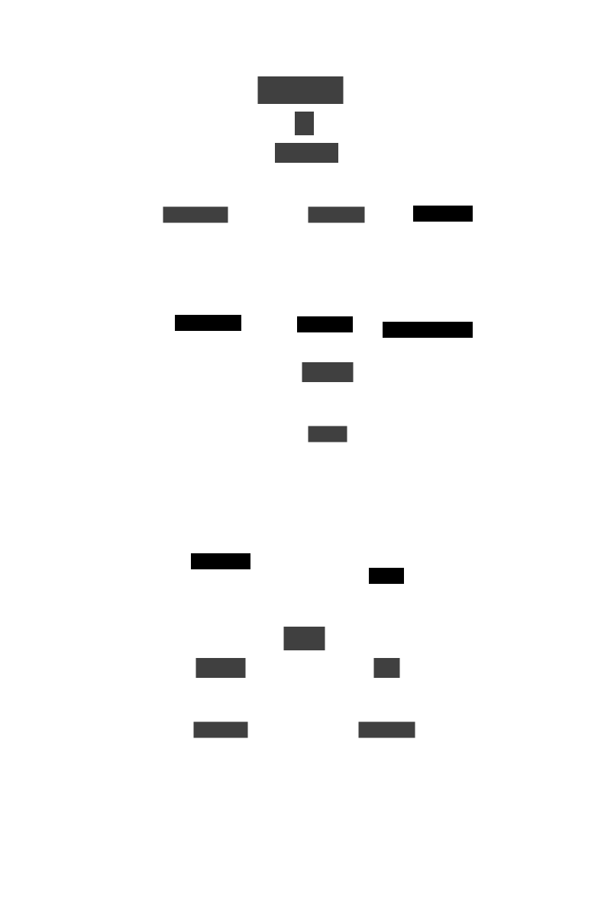
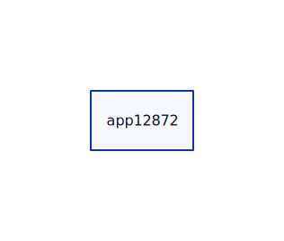
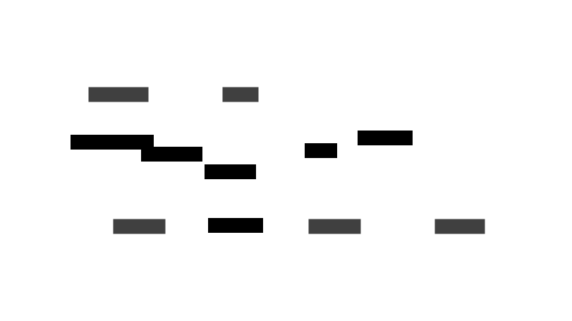

# The Graph API

## API reference

As the name suggests this api models the boxes and arrows as a graph, where the boxes are nodes and the arrows edges.

You should send a POST request to the `/graph/json` route with a json map with the following keys.

> [!NOTE]
> There is also a /graph/edn route which works identically except the concept should be posted in edn format with the http MIME content type of `application/edn`. See examples throughout this page.
> With edn, your have the option of using either strings or keywords as map keys. Both will work fine, but dictim.server does make an assumption that the choice is consistent, e.g. if data is specified with keyword keys, then any other part of the spec given to dictim.server that refers to particular keys in the data, will also use keywords.

*Manatory keys:*

| key | expanation |
| --- | ---------- |
| `"nodes"` | a json array of json objectts, each object being a representation of one node. The objects don't have to be homogenous (i.e. have the same keys) but often are if you representing multiple instances of the same type of thing. |
| `"edges"` | an array of objects, each object being a representation of one edge. Each edge must have `"src"` and `"dest"` keys and any other keys you need to model the edge. Again, they don't need to be homogenous but often are. the `"src"` and `"dest:"` keys are how you tie edges to nodes. The value of each of these keys must be the value of one of (the same one across all nodes) keys in the objectss representing the nodes. The pointer to that (node) key is.. |
| `"node->key"` | this indicates the key to use in node objects to uniquely represent that node. The value returned must be unique for each node. Often this could be some sort of `"id"` key. |

*Optional keys:*

| key | expanation |
| --- | ---------- |
| `"node-specs"` & `"edge-specs"` | map nodes and edges to the visual styles that should be used to display that node or edge. The values of these two keys are a mini dsl (domain specific language) that requires further explanation. Please see below for more details. |
| `"node->container"` | this indicates the key to use in node objects to map a node to its containing container (if it has/ needs one). |
| `"container->parent"` | this should be a json object that maps containers to their parent container (if needed) and is how you create hierarchies of containers within containers in the diagram. |
| `"container->attrs"` | a json objects that maps containers to the visual styles that should be used to display that container. |

An example of container->attrs:

```json
  "container->attrs": {
    "Securities": {
      "style.fill": "green"
    }
  }
```

is used to map a single container "Securities" to styling instructions that indicates that the fill color of that container should be green. Please see [this page](https://d2lang.com/tour/style) for details on styling options. You can also add a `"label"` entry to this json object, if you wish for the container to be labelled differently to its name.


### node-specs, edge-specs mini dsl


The values supplied to the `"node-specs"` or `"edge-specs"` keys have the same form, a json array of paired <test> <result> entries.. e.g.:

````json
.."node-specs": [<test1>, <result>, <test2>, <result2>, ...]
````

When a test is satisfied (by a node or edge), the result is read and used to determine how that node or edge is styled in the final diagram.

The syntax is tests is covered [here](https://github.com/judepayne/dictim/wiki/Template) on the dictim wiki.

In json form (with dictim.server), a test might look like:

````json
["=", "app_name", "Sunflower"]
````

The wiki page, mentions just three operators: `"="` `"!="` and `"match"`. In addition to those, you may use `"contains"` `"doesnt-contain"` `">"` `"<"` `">="` and `"<="`.

If, for example, one of your nodes is represented by this json object:

```json
{"app_id": 4789,
 "capabilities": ["data mgt", "data conversion"],
 "owner": "Scott"}
```

then this test would be true for that node:

```json
["and", ["=", "owner", "Scott"], ["contains", "capabilities", "data mgt"]]
```

and the corresponding result would be interpreted and used to style the node.

`"else"` is a special test which always evaluates to true for any node of edge, and would normally be placed in the second last position of a `"node-specs"` or `"edge-specs"` as a catch all.


The form of a result is a json object which can optionally have a `"label"` entry and any number of other entries. The other entries are assumed to be d2 (styling) attributes which are covered on dictim's syntax [wiki page](https://github.com/judepayne/dictim/wiki/Dictim-Syntax#Attributes).

`"label"` which sets the label of the node (or edge) is a bit special and has further processing applied to it.

When the value of `"label"` is a string, that is used for the label.

When it's a json object, it is interpreted.

```json
{"key": "app_id"}
```

would result in the `"app_id"` of the node or edge being used as its label.

```json
{"key": ["app_id", "owner"]}
```

would result in a label which takes the `"app_id"` of the node or edge, and its `"owner"` and concatenating with a `\newline` in between.


### Return values

Successful requests will result into a 200 response with a Content-Type of `image/svg+xml` and the svg of the image in the body.

Unsuccessful requests will result in a 400 response with the error message as the body.

A 401 Internal Server Error generally means that the json sent was invalid.


## Tutorial


Let's now build this example diagram one step at a time, by hand. This is of course not normally how you'd do it; rather you'd have code that generates the json diagram spec from data you have and pass the spec to dictim.server. Building by hand though is a good way to understand what all the keys in the diagram spec do.





is an architecture diagram that was built from this diagram spec..

<details><summary>Full diagram spec</summary>

```json
{
"nodes":[
    {
      "id":"app12872",
      "name":"Trade pad",
      "owner":"Lakshmi",
      "dept":"Finance",
      "functions":[
	"Position Keeping",
	"Quoting"
      ],
      "tco":1200000,
      "process":"p.112"
    },
    {
      "id":"app12873",
      "name":"Data Source",
      "owner":"India",
      "dept":"Securities",
      "functions":[
	"Booking",
	"Order Mgt"
      ],
      "tco":1100000,
      "process":"p.114"
    },
    {
      "id":"app12874",
      "name":"Crypto Bot",
      "owner":"Joesph",
      "dept":"Equities",
      "functions":[
	"Accounting",
	"Booking"
      ],
      "tco":500000,
      "process":"p.112"
    },
    {
      "id":"app12875",
      "name":"Data Solar",
      "owner":"Deepak",
      "dept":"Securities",
      "functions":[
	"Position Keeping",
	"Data Master"
      ],
      "tco":1000000,
      "process":"p.114"
    },
    {
      "id":"app12876",
      "name":"Data Solar",
      "owner":"Lakshmi",
      "dept":"Risk",
      "functions":[
	"Accounting",
	"Data Master"
      ],
      "tco":1700000,
      "process":"p.114"
    }
  ],
  "edges":[
    {
      "src":"app12874",
      "dest":"app12875",
      "data-type":"security reference"
    },
    {
      "src":"app12874",
      "dest":"app12876",
      "data-type":"quotes"
    },
    {
      "src":"app12875",
      "dest":"app12875",
      "data-type":"instructions"
    },
    {
      "src":"app12874",
      "dest":"app12872",
      "data-type":"instructions"
    },
    {
      "src":"app12875",
      "dest":"app12874",
      "data-type":"client master"
    },
    {
      "src":"app12875",
      "dest":"app12874",
      "data-type":"allocations"
    }
  ],
  "node->key":"id",
  "node->container":"dept",
  "container->parent":{
    "Finance":"2LOD",
    "Risk":"2LOD",
    "Securities":"FO",
    "Equities":"FO",
    "FO":"Company",
    "2LOD":"Company"
  },
  "node-specs":[
    [
      "=",
      "dept",
      "Equities"
    ],
    {"label":
      {
	"key": "owner"
      }
    },	    
    "else",
    {"label":
      {
	"key": "name"
      }
    }
  ],	  
  "edge-specs":[
     "else",
     {"label":
       {
	 "key": "data-type"
       }
     }
   ],
  "container->attrs":{
    "Securities":{
      "style.fill":"'#d6edd5'"
    }
  }
}
```

</details>


The `"nodes"` key is an array of nodes, each one being a json object of keys and values. Let look at one.

```json
{
  "id":"app12872",
  "name":"Trade pad",
  "owner":"Lakshmi",
  "dept":"Finance",
  "functions":["Position Keeping", "Quoting"],
  "tco":1200000,
  "process":"p.112"
}
```

Each node describes a box in the diagram. It's helpful to put more facts rather than less about the concept represented by the box; even some of those facts are not immediately represented in the diagram (e.g. the label of the box), because we're working with dynamic diagrams, we might choose to use one of those facts later e.g. in the label or to determine some styling aspect of how the box is represented.

We can make a diagram out of just this one node. Let's talk to dictim server with `curl`

```bash
curl --header "Content-Type: application/json" \
  --request POST \
  --data '{"nodes":[
		     {
		       "id":"app12872",
		       "name":"Trade pad",
		       "owner":"Lakshmi",
		       "dept":"Finance",
		       "functions":[
			 "Position Keeping",
			 "Quoting"
		       ],
		       "tco":1200000,
		       "process":"p.112"
		     }],
            "node->key": "id"
		 }' \
  http://localhost:5001/graph/json > out.svg
```

and have the result written to a file called `out.svg`





#### Edn eqivalent

The edn quivalent of the above command is

```bash
curl --header "Content-Type: application/edn" \
  --request POST \
  --data '{"nodes"
            [{"id" "app12872",
              "name" "Trade pad",
              "owner" "Lakshmi",
              "dept" "Finance",
              "functions" ["Position Keeping" "Quoting"],
              "tco" 1200000,
              "process" "p.112"}],
            "node->key" "id"}' \
  http://localhost:5001/graph/edn > out.svg
```

dictim.server is quite relaxed, about string keys or keyword keys asides from the requirement for consistency mentioned in the note at the top of this page.

This also works fine:


```bash
curl --header "Content-Type: application/edn" \
  --request POST \
  --data '{"nodes"
           [{:id "app12872"
             :name "Trade pad"
             :owner "Lakshmi"
             :dept "Finance"
             :functions ["Position Keeping" "Quoting"]
             :tco 1200000
             :process "p.112"}]
           "node->key" :id}' \
  http://localhost:5001/graph/edn > out.svg
```


Back to the tutorial...


As well as the `"node"` itself, we must have a `"node->key"` entry in the diagram spec or dictim.server will return an error.

The `"node->key"` entry serves two purposes:
- specifies the default label if no other label is specified by a `"node-specs"` entry.
- uniquely identifies the node, which we'll need later when adding edges that have a source and destination.


> [!NOTE]
> Each node in a diagram spec must have one key in the json object representing it which is unique. `"node->key"` needs to be set to that key name.


Let's now add in a second node and an edge between the two.

```bash
curl --header "Content-Type: application/json" \
  --request POST \
  --data '{"nodes":[
		     {
		       "id":"app12872",
		       "name":"Trade pad",
		       "owner":"Lakshmi",
		       "dept":"Finance",
		       "functions":[
			 "Position Keeping",
			 "Quoting"
		       ],
		       "tco":1200000,
		       "process":"p.112"
		     },
		     {
		       "id":"app12874",
		       "name":"Crypto Bot",
		       "owner":"Joesph",
		       "dept":"Equities",
		       "functions":[
			 "Accounting",
			 "Booking"
		       ],
		       "tco":500000,
		       "process":"p.112"
		     }],
	    "edges":[
	              {
			"src":"app12874",
			"dest":"app12872",
			"data-type":"instructions"
		      }],
	    "node->key": "id",
	    "node-specs":[
		      "else",
		      {"label":
			{
			  "key": "name"
			}
		      }
	            ]
		 }' \
  http://localhost:5001/graph/json > out.svg
```

Each `"edge"` is also just a json object. Unlike a `"node"` there are two keys that must always be present; `"src"` and `"dest"`, the source and destination of the edge. The value of these two keys must refer to the unique value of a node that we just talked about.

Beyond those two keys, the other entries making up an `"edge"` is arbitrary and can be as many as you want. As for `"nodes"` it's worth including more entries in each edge in case you need to use them later in your dynamic, evolving diagram, but in this example we've just added one `"data-type"` which represents the type of data flowing between two applications in our architecture diagram.

We've also added a `"node-specs"` entry into the diagram spec, and inside it is an `"else"` (i.e. catch all) clause that tells dictim.server to use the `"name"` key's value from each node as the label of that node.

Here's the diagram now.


 Let's add back in the other nodes, edges and an edge-spec that controls the labels used for the edges.

The edge-spec:

```json
"edge-specs":[
   "else",
   {"label":
     {
       "key": "data-type"
     }
   }
 ]
```

<details>
<summary>Full curl command</summary>

```bash
curl --header "Content-Type: application/json" \
  --request POST \
  --data '{
  "nodes":[
	    {
	      "id":"app12872",
	      "name":"Trade pad",
	      "owner":"Lakshmi",
	      "dept":"Finance",
	      "functions":[
		"Position Keeping",
		"Quoting"
	      ],
	      "tco":1200000,
	      "process":"p.112"
	    },
	    {
	      "id":"app12873",
	      "name":"Data Source",
	      "owner":"India",
	      "dept":"Securities",
	      "functions":[
		"Booking",
		"Order Mgt"
	      ],
	      "tco":1100000,
	      "process":"p.114"
	    },
	    {
	      "id":"app12874",
	      "name":"Crypto Bot",
	      "owner":"Joesph",
	      "dept":"Equities",
	      "functions":[
		"Accounting",
		"Booking"
	      ],
	      "tco":500000,
	      "process":"p.112"
	    },
	    {
	      "id":"app12875",
	      "name":"Data Solar",
	      "owner":"Deepak",
	      "dept":"Securities",
	      "functions":[
		"Position Keeping",
		"Data Master"
	      ],
	      "tco":1000000,
	      "process":"p.114"
	    },
	    {
	      "id":"app12876",
	      "name":"Data Solar",
	      "owner":"Lakshmi",
	      "dept":"Risk",
	      "functions":[
		"Accounting",
		"Data Master"
	      ],
	      "tco":1700000,
	      "process":"p.114"
	    }
	  ],
	  "edges":[
	    {
	      "src":"app12874",
	      "dest":"app12875",
	      "data-type":"security reference"
	    },
	    {
	      "src":"app12874",
	      "dest":"app12876",
	      "data-type":"quotes"
	    },
	    {
	      "src":"app12875",
	      "dest":"app12875",
	      "data-type":"instructions"
	    },
	    {
	      "src":"app12874",
	      "dest":"app12872",
	      "data-type":"instructions"
	    },
	    {
	      "src":"app12875",
	      "dest":"app12874",
	      "data-type":"client master"
	    },
	    {
	      "src":"app12875",
	      "dest":"app12874",
	      "data-type":"allocations"
	    }
	  ],
	  "node->key":"id",
	  "node-specs":[
	    [
              "=",
	      "dept",
	      "Equities"
            ],
	    {"label":
	      {
		"key": "owner"
	      }
	    },	    
	    "else",
	    {"label":
	      {
		"key": "name"
	      }
	    }
	  ],	  
	  "edge-specs":[
	     "else",
	     {"label":
	       {
		 "key": "data-type"
	       }
	     }
	   ]
	}' \
  http://localhost:5001/graph/json > out.svg
```

</details>


This is the diagram now



Notice that there's no node labelled "Crypto Bot" any longer. That's because we also added in a second test clause into the `"node-specs"`

```json
[
  "=",
  "dept",
  "Equities"
],
{"label":
  {
    "key": "owner"
  }
},	    
```

The condition part of this label instructions tell dictim.server that this instruction applies only to nodes where the value of the `"dept"` key is equals to "Equities", and when that is true to use the `"owner"` key from the node object rather than the default "name". Since this is a more specific test than the catch all `"else"`, it goes before that.

All that's left to do now is put the container instructions back into the diagram spec that handle how nodes are positioned into containers, how those containers are themselves positioned inside other containers, and how all the containers should be styled.


All this is handled with 3 additional keys. The first is `"node->container"` which indicates which key in each node is used to group the nodes into containers.

```json
	  "node->container":"dept",
```

The next is `"container->parent"` which provides the hierarchy of containers by mapping each container to its parent container.

```json
	  "container->parent":{
	    "Finance":"2LOD",
	    "Risk":"2LOD",
	    "Securities":"FO",
	    "Equities":"FO",
	    "FO":"Company",
	    "2LOD":"Company"
	  },
```

and finally there is `"container->attrs"` which is a json object that maps containers to their styles.

```json
	  "container->attrs":{
	    "Securities":{
	      "style.fill":"'#d6edd5'"
	    }
	  }
```
Please note that in dictim, hex colors (e.g. '#d6edd5') must be single quoted because d2 interprets `#` as a special character indicating a comment.

Now we're back at the original diagram!

<details>
<summary>Full curl command</summary>

```bash
curl --header "Content-Type: application/json" \
  --request POST \
  --data '{
  "nodes":[
	    {
	      "id":"app12872",
	      "name":"Trade pad",
	      "owner":"Lakshmi",
	      "dept":"Finance",
	      "functions":[
		"Position Keeping",
		"Quoting"
	      ],
	      "tco":1200000,
	      "process":"p.112"
	    },
	    {
	      "id":"app12873",
	      "name":"Data Source",
	      "owner":"India",
	      "dept":"Securities",
	      "functions":[
		"Booking",
		"Order Mgt"
	      ],
	      "tco":1100000,
	      "process":"p.114"
	    },
	    {
	      "id":"app12874",
	      "name":"Crypto Bot",
	      "owner":"Joesph",
	      "dept":"Equities",
	      "functions":[
		"Accounting",
		"Booking"
	      ],
	      "tco":500000,
	      "process":"p.112"
	    },
	    {
	      "id":"app12875",
	      "name":"Data Solar",
	      "owner":"Deepak",
	      "dept":"Securities",
	      "functions":[
		"Position Keeping",
		"Data Master"
	      ],
	      "tco":1000000,
	      "process":"p.114"
	    },
	    {
	      "id":"app12876",
	      "name":"Data Solar",
	      "owner":"Lakshmi",
	      "dept":"Risk",
	      "functions":[
		"Accounting",
		"Data Master"
	      ],
	      "tco":1700000,
	      "process":"p.114"
	    }
	  ],
	  "edges":[
	    {
	      "src":"app12874",
	      "dest":"app12875",
	      "data-type":"security reference"
	    },
	    {
	      "src":"app12874",
	      "dest":"app12876",
	      "data-type":"quotes"
	    },
	    {
	      "src":"app12875",
	      "dest":"app12875",
	      "data-type":"instructions"
	    },
	    {
	      "src":"app12874",
	      "dest":"app12872",
	      "data-type":"instructions"
	    },
	    {
	      "src":"app12875",
	      "dest":"app12874",
	      "data-type":"client master"
	    },
	    {
	      "src":"app12875",
	      "dest":"app12874",
	      "data-type":"allocations"
	    }
	  ],
	  "node->key":"id",
	  "node->container":"dept",
	  "container->parent":{
	    "Finance":"2LOD",
	    "Risk":"2LOD",
	    "Securities":"FO",
	    "Equities":"FO",
	    "FO":"Company",
	    "2LOD":"Company"
	  },
	  "node-specs":[
	    [
              "=",
	      "dept",
	      "Equities"
            ],
	    {"label":
	      {
		"key": "owner"
	      }
	    },	    
	    "else",
	    {"label":
	      {
		"key": "name"
	      }
	    }
	  ],	  
	  "edge-specs":[
	     "else",
	     {"label":
	       {
		 "key": "data-type"
	       }
	     }
	   ],
	  "container->attrs":{
	    "Securities":{
	      "style.fill":"'#d6edd5'"
	    }
	  }
	}' \
  http://localhost:5001/graph/json > out.svg
```

</details>


As a bonus and final step, let's add a conditional styling instruction under `"node-specs"` which styles nodes (application in our example) that contain the function 'Accounting' with a different fill and border radius.

```json
[
  "contains",
  "functions",
  "Accounting"
],
{
  "label":
  {
    "key": "owner"
  },	       
  "style.fill":"'#f4a261'",
  "style.border-radius":8
}
```


<details>
<summary>Full curl command</summary>

```bash
curl --header "Content-Type: application/json" \
  --request POST \
  --data '{
  "nodes":[
	    {
	      "id":"app12872",
	      "name":"Trade pad",
	      "owner":"Lakshmi",
	      "dept":"Finance",
	      "functions":[
		"Position Keeping",
		"Quoting"
	      ],
	      "tco":1200000,
	      "process":"p.112"
	    },
	    {
	      "id":"app12873",
	      "name":"Data Source",
	      "owner":"India",
	      "dept":"Securities",
	      "functions":[
		"Booking",
		"Order Mgt"
	      ],
	      "tco":1100000,
	      "process":"p.114"
	    },
	    {
	      "id":"app12874",
	      "name":"Crypto Bot",
	      "owner":"Joesph",
	      "dept":"Equities",
	      "functions":[
		"Accounting",
		"Booking"
	      ],
	      "tco":500000,
	      "process":"p.112"
	    },
	    {
	      "id":"app12875",
	      "name":"Data Solar",
	      "owner":"Deepak",
	      "dept":"Securities",
	      "functions":[
		"Position Keeping",
		"Data Master"
	      ],
	      "tco":1000000,
	      "process":"p.114"
	    },
	    {
	      "id":"app12876",
	      "name":"Data Solar",
	      "owner":"Lakshmi",
	      "dept":"Risk",
	      "functions":[
		"Accounting",
		"Data Master"
	      ],
	      "tco":1700000,
	      "process":"p.114"
	    }
	  ],
	  "edges":[
	    {
	      "src":"app12874",
	      "dest":"app12875",
	      "data-type":"security reference"
	    },
	    {
	      "src":"app12874",
	      "dest":"app12876",
	      "data-type":"quotes"
	    },
	    {
	      "src":"app12875",
	      "dest":"app12875",
	      "data-type":"instructions"
	    },
	    {
	      "src":"app12874",
	      "dest":"app12872",
	      "data-type":"instructions"
	    },
	    {
	      "src":"app12875",
	      "dest":"app12874",
	      "data-type":"client master"
	    },
	    {
	      "src":"app12875",
	      "dest":"app12874",
	      "data-type":"allocations"
	    }
	  ],
	  "node->key":"id",
	  "node->container":"dept",
	  "container->parent":{
	    "Finance":"2LOD",
	    "Risk":"2LOD",
	    "Securities":"FO",
	    "Equities":"FO",
	    "FO":"Company",
	    "2LOD":"Company"
	  },
	  "node-specs":[
	    [
              "contains",
	      "functions",
	      "Accounting"
            ],
	    {
	     "label":
	     {
	       "key": "owner"
	     },	       
	     "style.fill":"'#f4a261'",
	     "style.border-radius":8
	     },	    
	    [
              "=",
	      "dept",
	      "Equities"
            ],
	    {"label":
	      {
		"key": "owner"
	      }
	    },	    
	    "else",
	    {"label":
	      {
		"key": "name"
	      }
	    }
	  ],	  
	  "edge-specs":[
	     "else",
	     {"label":
	       {
		 "key": "data-type"
	       }
	     }
	   ],
	  "container->attrs":{
	    "Securities":{
	      "style.fill":"'#d6edd5'"
	    }
	  }
	}' \
  http://localhost:5001/graph/json > out.svg
````

</details>


## Edn graph route

The previous example converted to edn:

```bash
curl --header "Content-Type: application/edn" \
  --request POST \
  --data '{"nodes"
 [{"id" "app12872",
   "name" "Trade pad",
   "owner" "Lakshmi",
   "dept" "Finance",
   "functions" ["Position Keeping" "Quoting"],
   "tco" 1200000,
   "process" "p.112"}
  {"id" "app12873",
   "name" "Data Source",
   "owner" "India",
   "dept" "Securities",
   "functions" ["Booking" "Order Mgt"],
   "tco" 1100000,
   "process" "p.114"}
  {"id" "app12874",
   "name" "Crypto Bot",
   "owner" "Joesph",
   "dept" "Equities",
   "functions" ["Accounting" "Booking"],
   "tco" 500000,
   "process" "p.112"}
  {"id" "app12875",
   "name" "Data Solar",
   "owner" "Deepak",
   "dept" "Securities",
   "functions" ["Position Keeping" "Data Master"],
   "tco" 1000000,
   "process" "p.114"}
  {"id" "app12876",
   "name" "Data Solar",
   "owner" "Lakshmi",
   "dept" "Risk",
   "functions" ["Accounting" "Data Master"],
   "tco" 1700000,
   "process" "p.114"}],
 "edges"
 [{"src" "app12874",
   "dest" "app12875",
   "data-type" "security reference"}
  {"src" "app12874", "dest" "app12876", "data-type" "quotes"}
  {"src" "app12875", "dest" "app12875", "data-type" "instructions"}
  {"src" "app12874", "dest" "app12872", "data-type" "instructions"}
  {"src" "app12875", "dest" "app12874", "data-type" "client master"}
  {"src" "app12875", "dest" "app12874", "data-type" "allocations"}],
 "node->key" "id",
 "node->container" "dept",
 "container->parent"
 {"Finance" "2LOD",
  "Risk" "2LOD",
  "Securities" "FO",
  "Equities" "FO",
  "FO" "Company",
  "2LOD" "Company"},
 "node-specs"
 [["contains" "functions" "Accounting"]
  {"label" {"key" "owner"},
   "style.fill" "'#f4a261'",
   "style.border-radius" 8}
  ["=" "dept" "Equities"]
  {"label" {"key" "owner"}}
  "else"
  {"label" {"key" "name"}}],
 "edge-specs" ["else" {"label" {"key" "data-type"}}],
 "container->attrs" {"Securities" {"style.fill" "'#d6edd5'"}}}' \
  http://localhost:5001/graph/edn > out.svg
```

Note the `"Content-Type: application/edn"` and use of the `graph/edn` route.