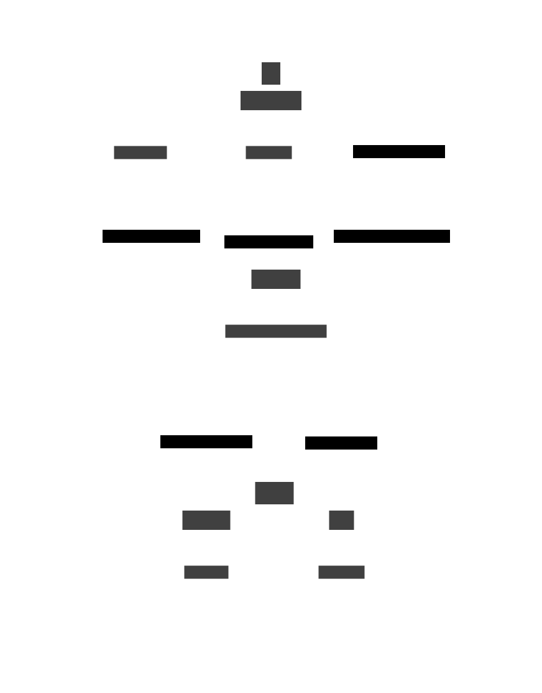
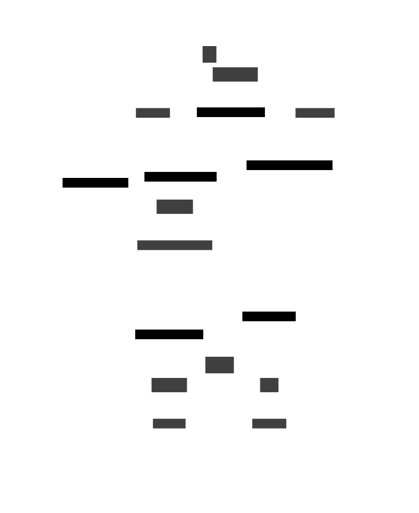

# The Graph API

## API reference

Expressing a diagram as a graph.

This guide will show example of sending POST requests to the `/graph/json` route. The `/graph/edn` route has idnetical functionality, but the differences are that you should POST an edn map rather than an json object and set the MIME content type to `application/edn` rather than `application/json`.

> [!NOTE]
> With edn, your have the option of using either strings or keywords as map keys. Both will work fine, but dictim.server does make an assumption that the choice is consistent, e.g. if data is specified with keyword keys, then any other part of the spec given to dictim.server that refers to particular keys in the data, will also use keywords.

The graph apis (both json and edn) are for expressing the shapes, containers and connections in your final diagram using graph notation, which is often a very antural way to think about a set of boxes (nodes) connected by arrows (edges). The graph api(s) is a higher level api than the dictim api(s). It's more suitable for programmatic use than raw dictimsince it comes with these advantages:

- Rather than specify dictim, which is a nested data format, the graph api 'flattens out' the data.
- You can specify the shapes, containers and connections modelled as data which is natural to their full business meaningful representation.
- attributes in the dictim/ d2 that control how elements are styled, can be set based on the business data using dictim template functionality. This means that styling can be set from (business) data which is itself does not make it directly into the dictim/ d2/ svg.

The json object/ edn map posted to the `/graph/` apis as called a 'graphspec' (i.e. a representation of a graph). That graph is then converted to dictim which in turn is converted to d2 from which svg is prodcued and returned.

A graphspec is specified as follows:

### Mandatory keys:

| key | expanation |
| --- | ---------- |
| `"nodes"` | a json array of json objects, each object being a representation of a shape. The objects don't have to be homogenous (i.e. have the same keys) but often are if you representing multiple instances of the same type of thing. The objects can be arbitrarily nested. |
| `"edges"` | an array of json objects, each object being a representation of one edge ('connection' in dictim/ d2 speak). Each edge must have `"src"` and `"dest"` keys and any other keys you need to model the edge. Again, they don't need to be homogenous but often are. Like `"node"`, arbitrary nested is fine. The `"src"` and `"dest:"` keys are how you tie edges to nodes. The values of the `"src"` and `"dest"` keys must tie to a unique way of identifying nodes..
| `"node->key"` | this indicates the key to use in node objects to uniquely represent that node. The value returned must be unique for each node. Often this could be some sort of `"id"` key. |


### Optional keys:
#### Controlling node and edge styles

| key | explanation |
| --- | ----------- |
| `"node-template"` | a json array of *test* to *attributes* pairs, where *test* is a json array whose syntax is covered [here](https://github.com/judepayne/dictim/wiki/Template). *attributes* is a dictim attribute map, which are compiled to d2 styles. The dictim syntax (incl. for attributes) is covered [here](https://github.com/judepayne/dictim/wiki/Dictim-Syntax#Attributes). `"else"` can be used as a catch-all test that always evaluates to true. The specified tests will be applied to each of the `"nodes"` and the result used to determine the *attributes*/ styles to be applied to the node in the final diagram. `"label"` is a special key that can be used in an *attributes* json object and is used to control the node's label when a test condition is met. Its use is detailed below. |
| `"edge-template"` | ditto, for edges. |


#### Controlling containers

| key | explanation |
| --- | ----------- |
| `"node->container"`| a single key (availble in each of the noes) used to group nodes into containers. |
| `"container->parent"` | a json object that represents the hierarchy of containers within (grouping) containers, by mapping containers to their (enclosing) parent container. |
| `"container->data"` | a jason object that maps a container to a json array which is the natural business-meaningful data represention of each of the containers. Used by |
| `"container-template"` | as per `"node-template"` and `"edge-template"` but for containers. Applied to the data representations of each container specified under the previous key `"container->data"`. |


Whereas the dictim apis are for specifying dictim which is a representation of the desired diagram, the graph apis allow you to specify nodes, edges and containers using whatever is the natural business-meaningful data representation and then separately control styling via the template constructs. Similarly, how the nodes are grouped into containers is broken out under explicit keys. The advantages of this approach are:

- **dynamism**  a tweak to the template keys/ container keys results in a differently styled/ organized diagram.
- **richness** styling and grouping can be determined by data that itself is not represented in the final diagram.


#### Directives

| key | explanation |
| --- | ----------- |
| `"directives"`| a json object of attributes which should be merged into the dictim (and then compiled) into d2 at the top level. Example use cases are [`"vars"`](https://d2lang.com/tour/vars), [`"classes"`](https://d2lang.com/tour/classes) and `"direction"` |


directives can be very useful for example as a single place to store all styles needed by the templates as classes and then use the `"class"` keyword throughout the templates.


#### Template

| key | explanation |
| --- | ----------- |
| `"template"` | a standard dictim tempate data structure, a json array. Unlike `"node-template"`, `"edge-template"` and `"container-template"` which operate on the data representing nodes, edges and containers during formation of the dictim, `"template"` operates on the dictim post-formation. That means that you should use standard accessors: 'key' 'label' 'attrs' 'children' 'keys' & 'element-type'. Attributes yielded by matching `"template"` tests will be merged into the dictim with lower precedence than attributes yielded by `"node-template"`, `"edge-template"` or `"container-template" |

Because of the lower precedence, `"template"` is using for creating 'background' styles, e.g. a standard styling that you wish to always be applied to diagrams.

The syntax of templates, including the use of dictim accessors is covered [here](https://github.com/judepayne/dictim/wiki/Template).


#### Controlling Labels

`"label"` is a special key that can be specified in a json object *attributes* in a template. `"label"` is not in dictim attribute or d2 style syntax.

When a `"label"` is specified, it controls the label applied to that node, container or connection. e.g.

````json
{"label": "I am a standard label",
 ... }
````

However, fixes labels are rarely that useful, hence ...

#### String interpolation in *attributes*

String interpolation is provided by `java.util.Formatter`.

When a label (or any other key in an *attributes* term in a template) is specified as a json array, that label is processed for string interpolation. e.g. (an *attributes* term in a `node-template`)

````json
{"label": ["node id%s\n owner: %s" "app-id" "owner-name"],
 ... }
````

is an instruction to create a label where the first %s is replaced by the value under the key "app-id", and the second %s is replaced by the value under the key "owner-name".

When the node, container or connection data is represented by nested json objects, a json array of keys can be used as a path to the desired value. e.g.

````json
{"label": ["node id%s\n owner: %s", ["ids", "app-id"], "owner-name"],
 ... }
````


String interpolation may be useful in a range of situations, not just for labels. For example, d2 has "tooltip", "link" and "icon" all of which could be useful places to embed data into.


### Example


A json graphspec that can be passed to the `/graph/json` api

````json
{
  "nodes": [
    {
      "id": "app12872",
      "name": "Trade pad",
      "owner": "Lakshmi",
      "dept": "Finance",
      "functions": [
        "Position Keeping",
        "Quoting"
      ],
      "tco": 1200000,
      "process": "p.112"
    },
    {
      "id": "app12873",
      "name": "Data Source",
      "owner": "India",
      "dept": "Securities",
      "functions": [
        "Booking",
        "Order Mgt"
      ],
      "tco": 1100000,
      "process": "p.114"
    },
    {
      "id": "app12874",
      "name": "Crypto Bot",
      "owner": "Joesph",
      "dept": "Equities",
      "functions": [
        "Accounting",
        "Booking"
      ],
      "tco": 500000,
      "process": "p.112"
    },
    {
      "id": "app12875",
      "name": "Data Solar",
      "owner": "Deepak",
      "dept": "Securities",
      "functions": [
        "Position Keeping",
        "Data Master"
      ],
      "tco": 1000000,
      "process": "p.114"
    },
    {
      "id": "app12876",
      "name": "Data Solar",
      "owner": "Lakshmi",
      "dept": "Risk",
      "functions": [
        "Accounting",
        "Data Master"
      ],
      "tco": 1700000,
      "process": "p.114"
    }
  ],
  "node->key": "id",
  "edges": [
    {
      "src": "app12874",
      "dest": "app12875",
      "data-type": "security reference"
    },
    {
      "src": "app12874",
      "dest": "app12876",
      "data-type": "quotes"
    },
    {
      "src": "app12875",
      "dest": "app12875",
      "data-type": "instructions"
    },
    {
      "src": "app12874",
      "dest": "app12872",
      "data-type": "instructions"
    },
    {
      "src": "app12875",
      "dest": "app12874",
      "data-type": "client master"
    },
    {
      "src": "app12875",
      "dest": "app12874",
      "data-type": "allocations"
    }
  ],
  "node-template": [
    [
      "=",
      "dept",
      "Equities"
    ],
    {
      "label": [
        "The name is is %s",
        "name"
      ],
      "style.fill": "blue"
    },
    "else",
    {
      "label": [
        "%s",
        "name"
      ]
    }
  ],
  "edge-template": [
    "else",
    {
      "label": [
        "data type: %s",
        "data-type"
      ]
    }
  ],
  "node->container": "dept",
  "container->parent": {
    "Finance": "2LOD",
    "Risk": "2LOD",
    "Securities": "FO",
    "Equities": "FO"
  },
  "container->data": {
    "Securities": {
      "head": "Amit Singh",
      "revenue $Bn": 1.1
    },
    "Equities": {
      "head": "Peter Nevitt",
      "revenue $Bn": 0.55
    },
    "Risk": {
      "head": "Amineer Singh",
      "revenue $Bn": 0
    },
    "Finance": {
      "head": "Cynthia Parcelle",
      "revenue $Bn": 0
    },
    "2LOD": {
      "head": "Markus Bauer",
      "revenue $Bn": 0
    },
    "FO": {
      "head": "Mia Fischer",
      "revenue $Bn": 2.37
    }
  },
  "container-template": [
    [
      ">",
      "revenue $Bn",
      1
    ],
    {
      "style.fill": "'#f2e7da'"
    },
    [
      ">",
      "revenue $Bn",
      0.5
    ],
    {
      "style.fill": "'#faf6f2'"
    }
  ]
}
````

and the `edn` equivlant that could be passed to the `/graph/edn` api:

<details>
<summary>edn</summary>

````edn
{"node->key" "id",
 "node-template"
 [["=" "dept" "Equities"]
  {"label" ["The name is %s" "name"], "style.fill" "blue"}
  "else"
  {"label" ["%s" "name"]}],
 "container->data"
 {"Securities" {"head" "Amit Singh", "revenue $Bn" 1.1},
  "Equities" {"head" "Peter Nevitt", "revenue $Bn" 0.55},
  "Risk" {"head" "Amineer Singh", "revenue $Bn" 0},
  "Finance" {"head" "Cynthia Parcelle", "revenue $Bn" 0},
  "2LOD" {"head" "Markus Bauer", "revenue $Bn" 0},
  "FO" {"head" "Mia Fischer", "revenue $Bn" 2.37}},
 "nodes"
 [{"id" "app12872",
   "name" "Trade pad",
   "owner" "Lakshmi",
   "dept" "Finance",
   "functions" ["Position Keeping" "Quoting"],
   "tco" 1200000,
   "process" "p.112"}
  {"id" "app12873",
   "name" "Data Source",
   "owner" "India",
   "dept" "Securities",
   "functions" ["Booking" "Order Mgt"],
   "tco" 1100000,
   "process" "p.114"}
  {"id" "app12874",
   "name" "Crypto Bot",
   "owner" "Joesph",
   "dept" "Equities",
   "functions" ["Accounting" "Booking"],
   "tco" 500000,
   "process" "p.112"}
  {"id" "app12875",
   "name" "Data Solar",
   "owner" "Deepak",
   "dept" "Securities",
   "functions" ["Position Keeping" "Data Master"],
   "tco" 1000000,
   "process" "p.114"}
  {"id" "app12876",
   "name" "Data Solar",
   "owner" "Lakshmi",
   "dept" "Risk",
   "functions" ["Accounting" "Data Master"],
   "tco" 1700000,
   "process" "p.114"}],
 "node->container" "dept",
 "edges"
 [{"src" "app12874",
   "dest" "app12875",
   "data-type" "security reference"}
  {"src" "app12874", "dest" "app12876", "data-type" "quotes"}
  {"src" "app12875", "dest" "app12875", "data-type" "instructions"}
  {"src" "app12874", "dest" "app12872", "data-type" "instructions"}
  {"src" "app12875", "dest" "app12874", "data-type" "client master"}
  {"src" "app12875", "dest" "app12874", "data-type" "allocations"}],
 "container-template"
 [[">" "revenue $Bn" 1]
  {"style.fill" "'#f2e7da'"}
  [">" "revenue $Bn" 0.5]
  {"style.fill" "'#faf6f2'"}],
 "edge-template" ["else" {"label" ["data type: %s" "data-type"]}],
 "container->parent"
 {"Finance" "2LOD",
  "Risk" "2LOD",
  "Securities" "FO",
  "Equities" "FO"}}
````
</details>

Let's use the json example in a curl command like this:

<details>
<summary>full curl command</summary>

````bash
curl --header "Content-Type: application/json" \
  --request POST \
  --data '{
  "nodes": [
    {
      "id": "app12872",
      "name": "Trade pad",
      "owner": "Lakshmi",
      "dept": "Finance",
      "functions": [
        "Position Keeping",
        "Quoting"
      ],
      "tco": 1200000,
      "process": "p.112"
    },
    {
      "id": "app12873",
      "name": "Data Source",
      "owner": "India",
      "dept": "Securities",
      "functions": [
        "Booking",
        "Order Mgt"
      ],
      "tco": 1100000,
      "process": "p.114"
    },
    {
      "id": "app12874",
      "name": "Crypto Bot",
      "owner": "Joesph",
      "dept": "Equities",
      "functions": [
        "Accounting",
        "Booking"
      ],
      "tco": 500000,
      "process": "p.112"
    },
    {
      "id": "app12875",
      "name": "Data Solar",
      "owner": "Deepak",
      "dept": "Securities",
      "functions": [
        "Position Keeping",
        "Data Master"
      ],
      "tco": 1000000,
      "process": "p.114"
    },
    {
      "id": "app12876",
      "name": "Data Solar",
      "owner": "Lakshmi",
      "dept": "Risk",
      "functions": [
        "Accounting",
        "Data Master"
      ],
      "tco": 1700000,
      "process": "p.114"
    }
  ],
  "node->key": "id",
  "edges": [
    {
      "src": "app12874",
      "dest": "app12875",
      "data-type": "security reference"
    },
    {
      "src": "app12874",
      "dest": "app12876",
      "data-type": "quotes"
    },
    {
      "src": "app12875",
      "dest": "app12875",
      "data-type": "instructions"
    },
    {
      "src": "app12874",
      "dest": "app12872",
      "data-type": "instructions"
    },
    {
      "src": "app12875",
      "dest": "app12874",
      "data-type": "client master"
    },
    {
      "src": "app12875",
      "dest": "app12874",
      "data-type": "allocations"
    }
  ],
  "node-template": [
    [
      "=",
      "dept",
      "Equities"
    ],
    {
      "label": [
        "The name is %s",
        "name"
      ],
      "style.fill": "blue"
    },
    "else",
    {
      "label": [
        "%s",
        "name"
      ]
    }
  ],
  "edge-template": [
    "else",
    {
      "label": [
        "data type: %s",
        "data-type"
      ]
    }
  ],
  "node->container": "dept",
  "container->parent": {
    "Finance": "2LOD",
    "Risk": "2LOD",
    "Securities": "FO",
    "Equities": "FO"
  },
  "container->data": {
    "Securities": {
      "head": "Amit Singh",
      "revenue $Bn": 1.1
    },
    "Equities": {
      "head": "Peter Nevitt",
      "revenue $Bn": 0.55
    },
    "Risk": {
      "head": "Amineer Singh",
      "revenue $Bn": 0
    },
    "Finance": {
      "head": "Cynthia Parcelle",
      "revenue $Bn": 0
    },
    "2LOD": {
      "head": "Markus Bauer",
      "revenue $Bn": 0
    },
    "FO": {
      "head": "Mia Fischer",
      "revenue $Bn": 2.37
    }
  },
  "container-template": [
    [
      ">",
      "revenue $Bn",
      1
    ],
    {
      "style.fill": "'#f2e7da'"
    },
    [
      ">",
      "revenue $Bn",
      0.5
    ],
    {
      "style.fill": "'#faf6f2'"
    }
  ]
}' \
  http://localhost:5001/graph/json
````

</details>

resulting in this svg diagram..





#### Adding 'directives' and 'template'

Using the edn example, above, let's use the additional features provided by directives and template.


````bash
curl --header "Content-Type: application/edn" \
  --request POST \
  --data '{"node->key" "id",
 "node-template"
 [["=" "dept" "Equities"]
  {"label" ["The name is %s" "name"], "style.fill" "honeydew"}
  "else"
  {"label" ["%s" "name"]}],
 "container->data"
 {"Securities" {"head" "Amit Singh", "revenue $Bn" 1.1},
  "Equities" {"head" "Peter Nevitt", "revenue $Bn" 0.55},
  "Risk" {"head" "Amineer Singh", "revenue $Bn" 0},
  "Finance" {"head" "Cynthia Parcelle", "revenue $Bn" 0},
  "2LOD" {"head" "Markus Bauer", "revenue $Bn" 0},
  "FO" {"head" "Mia Fischer", "revenue $Bn" 2.37}},
 "nodes"
 [{"id" "app12872",
   "name" "Trade pad",
   "owner" "Lakshmi",
   "dept" "Finance",
   "functions" ["Position Keeping" "Quoting"],
   "tco" 1200000,
   "process" "p.112"}
  {"id" "app12873",
   "name" "Data Source",
   "owner" "India",
   "dept" "Securities",
   "functions" ["Booking" "Order Mgt"],
   "tco" 1100000,
   "process" "p.114"}
  {"id" "app12874",
   "name" "Crypto Bot",
   "owner" "Joesph",
   "dept" "Equities",
   "functions" ["Accounting" "Booking"],
   "tco" 500000,
   "process" "p.112"}
  {"id" "app12875",
   "name" "Data Solar",
   "owner" "Deepak",
   "dept" "Securities",
   "functions" ["Position Keeping" "Data Master"],
   "tco" 1000000,
   "process" "p.114"}
  {"id" "app12876",
   "name" "Data Solar",
   "owner" "Lakshmi",
   "dept" "Risk",
   "functions" ["Accounting" "Data Master"],
   "tco" 1700000,
   "process" "p.114"}],
 "node->container" "dept",
 "edges"
 [{"src" "app12874",
   "dest" "app12875",
   "data-type" "security reference"}
  {"src" "app12874", "dest" "app12876", "data-type" "quotes"}
  {"src" "app12875", "dest" "app12875", "data-type" "instructions"}
  {"src" "app12874", "dest" "app12872", "data-type" "instructions"}
  {"src" "app12875", "dest" "app12874", "data-type" "client master"}
  {"src" "app12875", "dest" "app12874", "data-type" "allocations"}],
 "container-template"
 [[">" "revenue $Bn" 1] {"class" "large"}
  [">" "revenue $Bn" 0.5] {"class" "medium"}],
 "edge-template" ["else" {"label" ["data type: %s" "data-type"]}],
 "container->parent"
 {"Finance" "2LOD",
  "Risk" "2LOD",
  "Securities" "FO",
  "Equities" "FO"}
 "directives"
 {"classes" {"large" {"style.fill" "'#f2e7da'"}
             "medium" {"style.fill" "'#faf6f2'"}}}
 "template"
 [["=" "element-type" "ctr"] {"style.border-radius" 8}
  ["=" "element-type" "shape"] {"style.border-radius" 3
                                "style.shadow" true}]}' \
http://localhost:5001/graph/edn
````

`"directives"` have been used to hold the class definition which have been rationalized out of `"container-template"`, and `"template"` has been used to provide some 'background' styling for containers and nodes.

resulting in this (ever so slightly!) prettier diagram:


